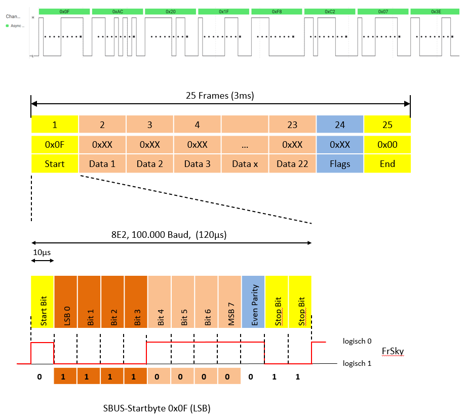

## FrSky SBUS 8E2, 100.000 Baud (Futaba invers)

a Micropython driver for the SBUS protocol on Rpi Pic

It supports 16 standard Channels plus 2 digitals.

### Data
Data Byte 0:[ch1.7 ch1.6 ch1.5 ch1.4 ch1.3 ch1.2 ch1.1 ch1.0]

Data Byte 1:[ch2.4 ch2.3 ch2.2 ch2.1 ch2.0 ch1.10 ch1.9 ch1.8]

Data Byte 2:[ch3.1 ch3.0 ch2.10 ch2.9 ch2.8 ch2.7 ch2.6 ch2.5]

Data Byte n: ...

### Beispiel 

#### Kanal 1 (low)
0x0F: 00001111 Start Byte

0xAC: 10101100 Byte 1

0x20: 00100000 Byte 2

0x1F: 00011111 Byte 3

#### Dekodiert
172:  000 10101100 Kanal 1

996:  011111 00100 Kanal 2

#### Kanal 1 (high)
0x0F: 00001111 Start Byte

0x13: 00010011 Byte 1

0x27: 00100111 Byte 2

0x5F: 01011111 Byte 3

#### Dekodiert
1811: 111 00010011 Kanal 1

996:  011111 00100 Kanal 2

It has been tested only on the below FrSky receivers:

    RX6R

An example of usage can be found in the file SBUS.py

